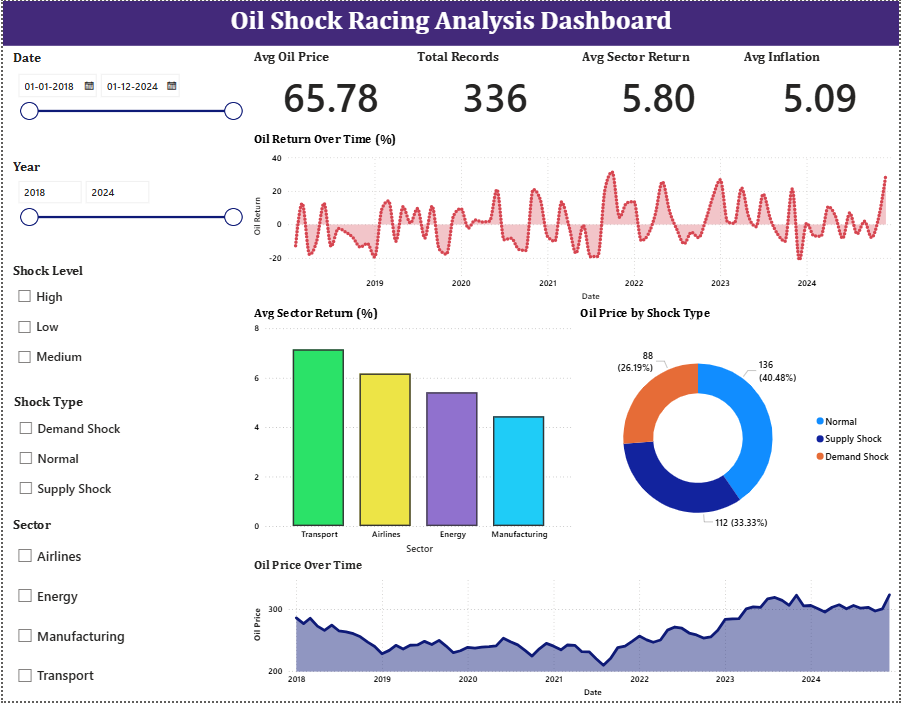

# Oil-Shock-Racing-Dashboard

OIL SHOCK RACING –  DATA ANALYTICS & DASHBOARD

This project focuses on analyzing the impact of oil price shocks on sector performance and key macroeconomic indicators through a structured data workflow and interactive dashboard.

The dataset was prepared using data cleaning, transformation, and feature engineering techniques. The final processed dataset was used to develop a Power BI dashboard for analyzing relationships between oil price movements, sector returns, and economic trends.

Key Highlights

- Oil price trend and shock pattern analysis
- Sector-wise performance comparison
- Macroeconomic impact analysis (Inflation, GDP, Interest Rates)
- Correlation between oil price movements and sector returns
- Shock level categorization (High, Medium, Low)

---

Tools & Technologies

- Python (Pandas, NumPy)
- Jupyter Notebook
- Microsoft Excel
- Power BI

---

Dashboard

